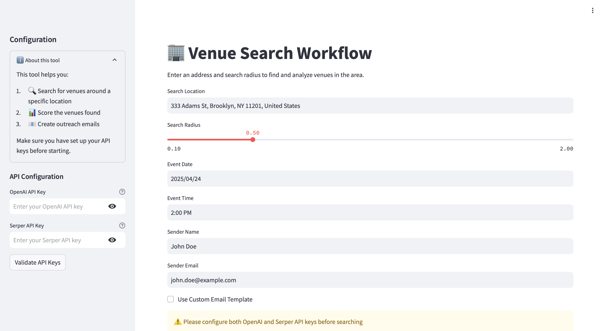

# venue-research-agentic-workflow
Development of multi-agent system designed to identify and evaluate potential venues near technology conference locations in cities. The agent will automate the process of researching suitable venues, analyzing their features, scoring them based on predefined criteria, and initiating contact with high-potential venues for business opportunities.

