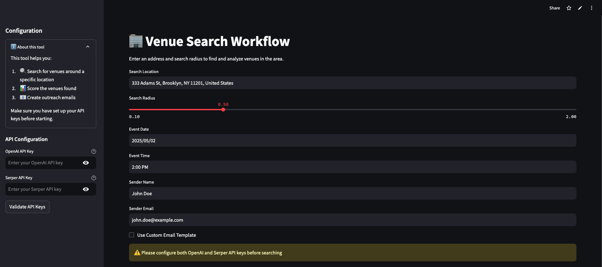
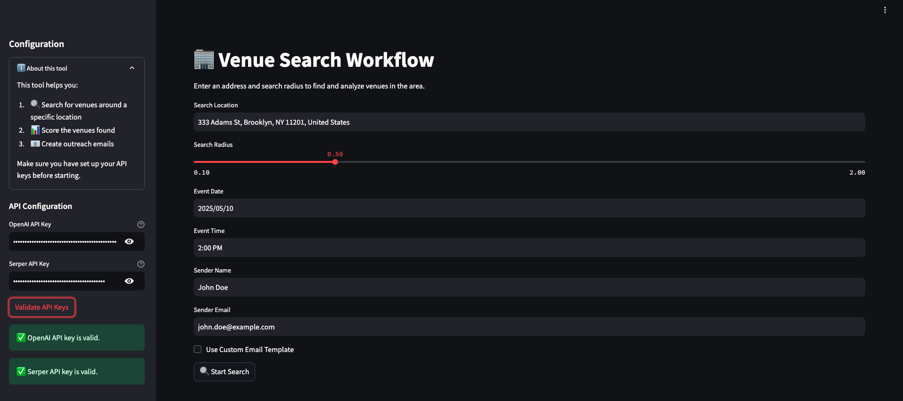
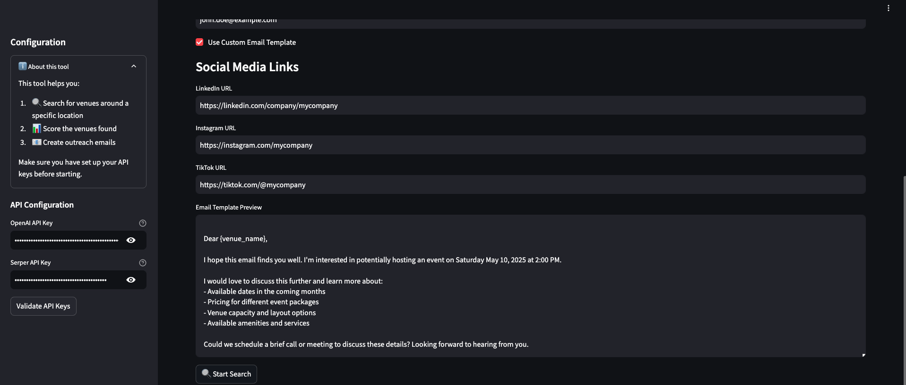
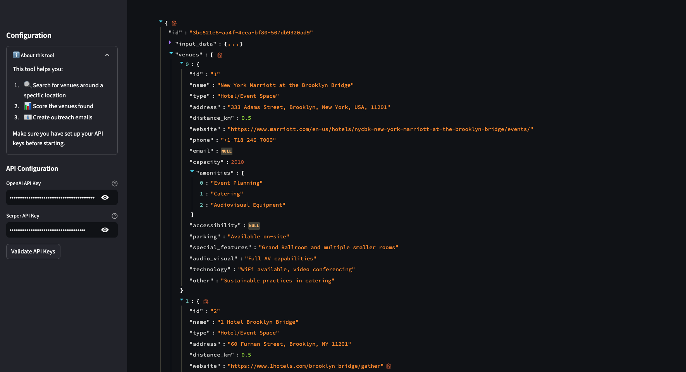

# Building an AI-Powered Venue Research Multi-Agent System with CrewAI

## Introduction

AI Agents are the latest trend in the race to AGI. What is captivating about building AI agents is the potential to automate all kinds of work. The idea to build a venue research multi-agent system came to me when my friend, who runs a tech mixer event mentioned all of the work that he has to do finding venues. 

This felt like a great opportunity to get hands-on experience with AI agents. Now, I will share how I built the system with you. This tutorial shows how to use CrewAI to create multi-agent agents that search, evaluate, and reach out to potential event venues.

You can find the complete source code for this project on GitHub:
- Repository: [venue-score-flow](https://github.com/mobatusi/venue-research-agentic-workflow)
- Live Demo: [Event Planning Research Assistant](https://event-planning-research-assistant.streamlit.app/)

## The Challenge

Manual venue research is time-consuming and often inconsistent. Event planners spend countless hours searching across platforms like PartySlate and Peerspace, evaluating venues, and reaching out to vendors. In this tutorial, I will show you how to automate this entire workflow using CrewAI's multi-agent architecture.

This solution has the potential to help event planners:
- Reduce venue research time from days to minutes
- Ensure consistent venue evaluation across platforms
- Automate personalized vendor outreach
- Enable less experienced team members to manage venue searches effectively


Try it out: https://event-planning-research-assistant.streamlit.app/

## Building with CrewAI

### Step 1: Setting Up the Pydantic Models

First, let's define our data models using Pydantic. These models will help us maintain type safety and data validation throughout our application:

```python
from pydantic import BaseModel, Field
from typing import List, Dict, Optional
from datetime import datetime

class InputData(BaseModel):
    """User input data for venue search"""
    location: str
    radius: int 
    event_info: str
    sender_name: str
    sender_company: str
    sender_email: str

class Venue(BaseModel):
    """Represents a venue found during search"""
    id: str = Field(default_factory=lambda: str(uuid.uuid4()))
    name: str
    address: str
    description: str
    website: Optional[str] = None
    phone: Optional[str] = None
    email: Optional[str] = None
    created_at: datetime = Field(default_factory=datetime.now)

class VenueScore(BaseModel):
    """Venue evaluation scores and reasoning"""
    name: str
    score: int  # 1-100
    reason: str
    created_at: datetime = Field(default_factory=datetime.now)

class ScoredVenues(BaseModel):
    """Combined venue data with scores"""
    id: str
    name: str
    address: str
    description: str
    website: Optional[str] = None
    phone: Optional[str] = None
    email: Optional[str] = None
    score: int
    reason: str
    created_at: datetime
```

These models serve different purposes in our workflow:

1. `InputData`: Captures user requirements and contact information
2. `Venue`: Stores raw venue data from our search results
3. `VenueScore`: Contains the AI agent's evaluation of each venue
4. `ScoredVenues`: Combines venue information with its evaluation score

### Step 2: Setting Up the Agent Architecture

The system uses three specialized crews, each handling a different aspect of the venue research process:

1. Venue Search Crew - Discovers potential venues
2. Venue Score Crew - Evaluates venues based on criteria
3. Venue Response Crew - Generates outreach emails

Here's how to create your first crew:

```python
@CrewBase
class VenueSearchCrew:
    @crew
    def crew(self) -> Crew:
        return Crew(
            agents=[self.location_analyst()],
            tasks=[self.analyze_location()],
            process=Process.sequential,
            verbose=True,
        )
```

### Step 3: Implementing the Workflow

The workflow uses decorators (learn more about Python decorators [here](https://www.geeksforgeeks.org/decorators-in-python/)) to manage the sequence of operations. Here's how it works:

```python
class VenueScoreFlow(Flow):
    def __init__(
        self,
        openai_key: str,
        serper_key: str,
        input_data: InputData,
    ):
        super().__init__()
        self.openai_key = openai_key
        self.serper_key = serper_key
        self.state.input_data = input_data

    @start()
    async def initialize_state(self) -> None:
        """Initialize the flow state and set up API keys"""
        print("Starting VenueScoreFlow")
        os.environ["OPENAI_API_KEY"] = self.openai_key
        os.environ["SERPER_API_KEY"] = self.serper_key

    @listen("initialize_state")
    async def search_venues(self):
        """Search for venues after initialization"""
        print("Searching for venues...")
        search_crew = VenueSearchCrew()
        result = await search_crew.crew().kickoff_async(
            inputs={"input_data": self.state.input_data}
        )
        
        # Parse and store venues in state
        venues_data = json.loads(result.raw)
        for venue_data in venues_data:
            if isinstance(venue_data, dict):
                try:
                    venue = Venue(**venue_data)
                    self.state.venues.append(venue)
                except ValidationError as e:
                    print(f"Validation error: {e}")
```

The workflow is managed through several key components:

1. **Flow Initialization**
   - The `@start()` decorator marks the entry point
   - Sets up required API keys and initializes state
   - Triggers the first step in the workflow

2. **Event Listeners**
   - `@listen()` decorators create a chain of dependent tasks
   - Each listener waits for completion of previous tasks
   - Ensures tasks execute in the correct order

3. **Crew Management**
   - Each major task is handled by a specialized crew
   - Crews are instantiated and executed asynchronously
   - Results are stored in the shared state

Here's how the scoring crew is implemented:

```python
@listen(or_(search_venues, "score_venues_feedback"))
async def score_venues(self):
    """Score venues after search or feedback"""
    print("Scoring venues...")
    tasks = []
    
    for venue in self.state.venues:
        score_crew = VenueScoreCrew()
        task = score_crew.crew().kickoff_async(
            inputs={
                "venue": venue,
                "event_info": self.state.input_data.event_info
            }
        )
        tasks.append(task)
    
    # Process all venues concurrently
    venue_scores = await asyncio.gather(*tasks)
    self.state.venue_score = [
        score for score in venue_scores 
        if score is not None
    ]
```

The workflow follows this sequence:
1. Initialize state and API keys
2. Search for venues using the search crew
3. Score venues using the scoring crew
4. Generate emails using the response crew

Each step waits for the completion of its dependencies, ensuring data consistency throughout the process.

## Enhancing the System

Here are some ways to extend the basic implementation:

1. **Add Human Feedback**
   - Implement feedback loops for venue scoring using crew.train()
   - Allow manual review of generated emails
   - Enable custom scoring criteria

2. **Improve SearchResults**
   - Integrate reasoning models such as OpenAI's o1 or o1 preview for venue recommendations. Just be sure to pay attention to the cost of this model.
   - Consider updating the Crew design to include more sophisticated agents.
   - Implement historical performance tracking

3. **Evaluate the results**
   - Consider using [Langtrace](https://docs.crewai.com/how-to/langtrace-observability#langtrace-overview) to evaluate the results of the crew.

## The Solution

The venue research application provides a simple web interface to automate venue discovery and outreach. Here's how to use it:



### Step 1: Configure API Keys
1. Get your API keys:
   - OpenAI API key from [OpenAI Platform](https://platform.openai.com/api-keys)
   - Serper API key from [Serper.dev](https://serper.dev)
2. Enter both API keys in the sidebar
3. Click "Validate API Keys" to ensure they work

### Step 2: Enter Search Parameters and Custom Email Template
1. Location Details:
   - Enter the city or area where you want to find venues
   - Specify search radius in miles (e.g., 5, 10, 20)

2. Event Information:
   - Describe your event details:
     - Event date
     - Event time
   
3. Contact Information:
   - Your full name
   - Company name
   - Professional email address

4. Click "Use Custom Email Template" to use a custom email template

  - Social Media Links
    - Linkedin Url
    - Instagram Url
    - TikTok Url
  - The system generates a default email template if this is not checked

### Step 3: Run the Search
1. Click "Start Venue Search" to begin the process
2. The system will:
   - Search for venues matching your criteria
   - Evaluate each venue's suitability
   - Generate personalized outreach emails

### Step 4: Review Results

1. View the Venue List:
   - Each venue includes details like location, capacity, and amenities
   - Review AI-generated scores and reasoning
   
2. Check Generated Emails:
   - Review personalized outreach emails for each venue
   - Emails are saved in the email_responses directory
   - Edit as needed before sending

### Tips for Best Results
- Include all important requirements upfront
- Review and customize generated emails before sending
- Use the feedback option if venue scores need adjustment

Try it yourself: [Event Planning Research Assistant](https://event-planning-research-assistant.streamlit.app/)

## Conclusion

Hopefully, this tutorial provided some clarity into building multi-agent systems using CrewAI and did not confuse you. Overall, the best way to learn is through application and building a multi-agent venue research system with CrewAI doesn't have to be complicated, especially since there are [examples] (https://github.com/crewAIInc/crewAI-examples/tree/main) with different multi-agent architectures to learn from. 

## Resources

- [GitHub Repository](https://github.com/evanmschultz/venue-score-flow)
- [CrewAI Documentation](https://docs.crewai.com/concepts/flows#flow-state-management)
- [Multi AI Agent Systems Tutorial](https://learn.deeplearning.ai/courses/multi-ai-agent-systems-with-crewai/lesson/1/introduction)
- [OpenAI API Documentation](https://platform.openai.com/docs/api-reference)
- [Streamlit Documentation](https://docs.streamlit.io/)
